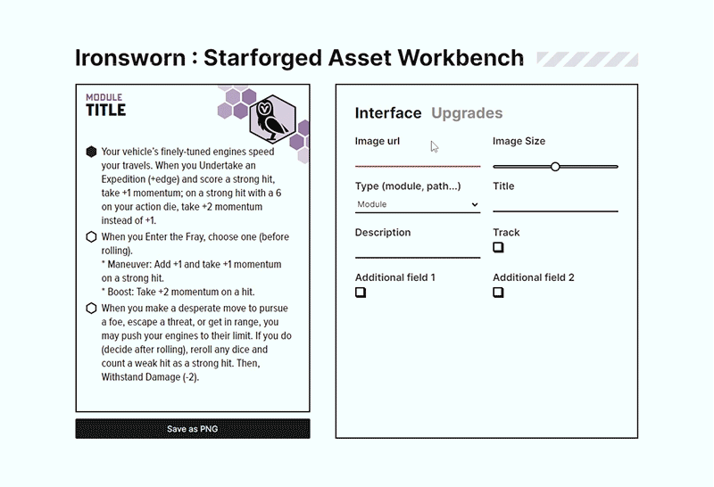
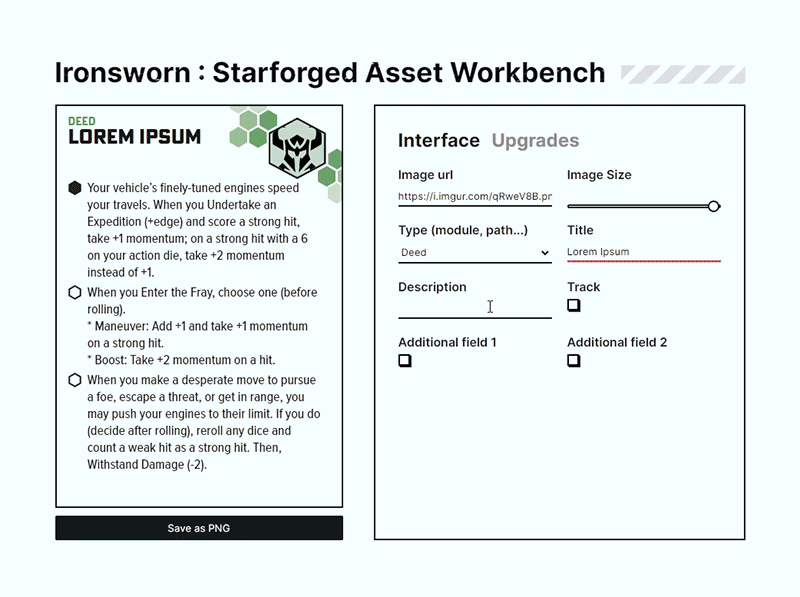
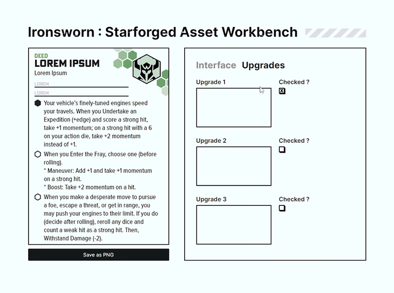
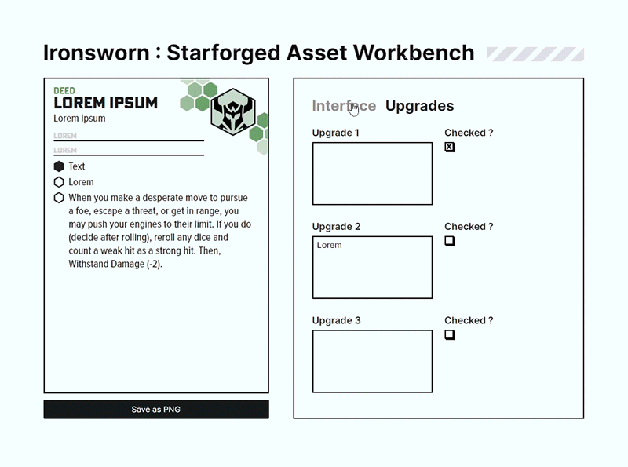

▶️ [App](https://starforged-asset-workbench.vercel.app/)

## 📄 Description
Inspired by effortlessmoutain's [Asset Workbench](https://github.com/effortlessmountain/ironsworn-asset-workbench), the *Starforged Asset Workbench* can be used to create custom assets for [Ironsworn : Starforged](https://www.ironswornrpg.com/product-ironsworn-starforged) while keeping the same aesthetic as the game's default assets.

## 💡 Tips
- For the image, you can easily find icons at [Game-icons.net](https://game-icons.net/) and host it on Imgur. I suggest changing the background to "none" and the foreground to black in game-icons editor to stick with Starforged's aesthetic ! 

## 🔎 Functionalities 

- You can change the card image and its size.
- You can change the type of asset, and card's colors with automatically adjust. 

- You can change the asset's title and description. 
- You can add a track and its possible value.
- You can add two additional fields and their placeholder text.

- In the Upgrades section, you can change all three possible upgrades description and whether or not they're checked by default.

- Once your asset is done, you can export it to PNG with "Save as PNG".

## 🔨 Made With
- React
- JavaScript
- SCSS